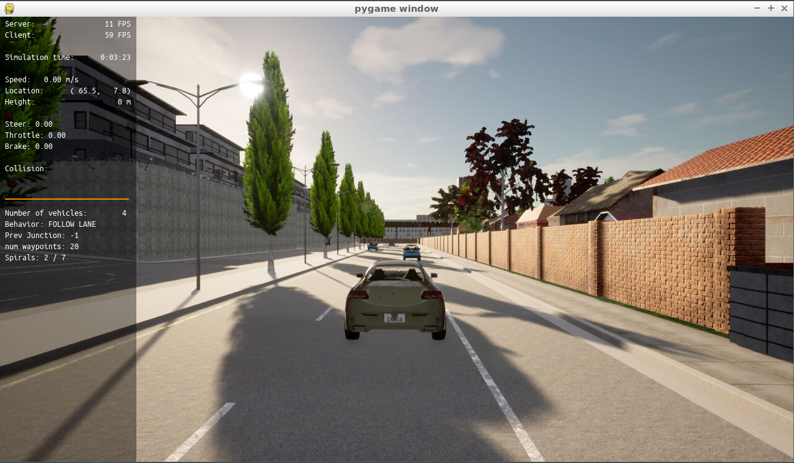
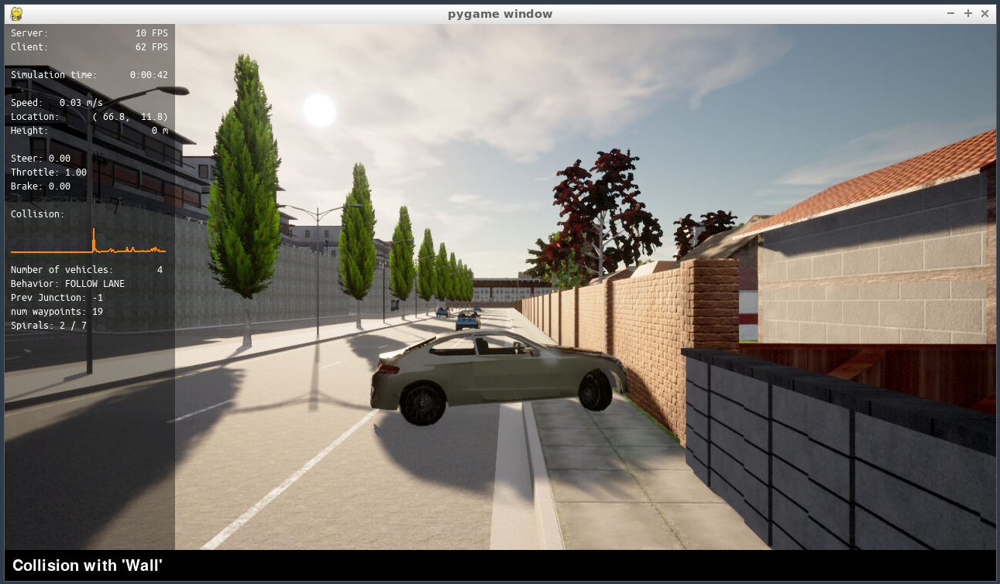
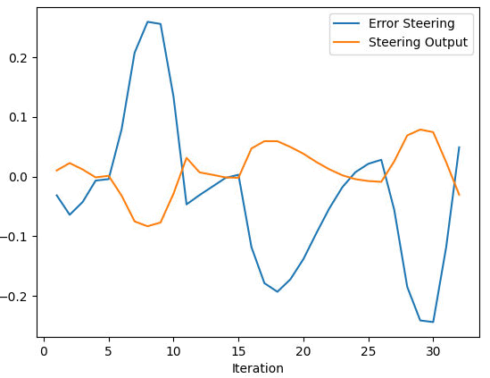
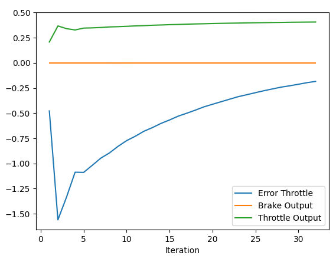

Not everything goes the right way.... and that is what happend the first time I run the simulator with all the steps.

# Add the plots to your report and explain them (describe what you see)

| Steer data:    |                |                 |                 |          |
|----------------|----------------|-----------------|-----------------|----------|
|                |    Iteration   | Error Steering  | Steering Output |          |
| 0              | 1              | -0.031442       | 0.010320        |          |
| 1              | 2              | -0.064048       | 0.022689        |          |
| 2              | 3              | -0.042507       | 0.011974        |          |
| 3              | 4              | -0.006661       | -0.001280       |          |
| 4              | 5              | -0.004224       | 0.001334        |          |

| Throttle data: |                |                 |                 |          |
|----------------|----------------|-----------------|-----------------|----------|
|                |    Iteration   |  Error Throttle |   Brake Output  | Throttle Output |
| 0              | 1              | -0.477727       | 0               | 0.207323 |
| 1              | 2              | -1.559430       | 0               | 0.367126 |
| 2              | 3              | -1.334260       | 0               | 0.339970 |
| 3              | 4              | -1.086480       | 0               | 0.326957 |
| 4              | 5              | -1.088350       | 0               | 0.345478 |

As it can be seen in the graphs and the table, the error from both, the throttle and the steering is being corrected throughout the iterations.

But as it can be seen, this combination of coeficients is not really good for the steering because the error in the half of the ireations, it grows instead of downsizing. Causing "erratic" movements.

# What is the effect of the PID according to the plots, how each part of the PID affects the control command?

The PID controller minimizes the error in a short range of time. PID controller can minimize the error between the curernt speed/yaw angle of the vehicle by producing control output.

The P is for **proportional controller** which provides an output porportional to the current error. It compares a set of points with the current value, returning a error. This error is the result from the multiply between a constant and the current error.

The I is for **integral controller**. It helps to reduce time to minimize the CTE (Cross Track Error). Since it is an integral, when a negative error happens, the controller decreases the output.

The D is for **derivative controller**. It improves the stability of the system by compensation increasing the derivative. If the gain is too low the object (in this case the car) will still oscillate. On the other hand, if the gain is too high it will cause to take long time to correct the offsets. A good gain D can approach cthe desired trajectory much faster.

# How would you design a way to automatically tune the PID parameters?

As seen on the module, one of the best ways is to use the **twiddle**. This algorithm can optimize a set of parameters giving some initial values for the PID. It works modifying the initial values with some formulas (not going to be that explicit) and depending on the output it decreases the value or increases it. It does that with each one of the parameters you wnat to send.

# PID controller is a model free controller, i.e. it does not use a model of the car. Could you explain the pros and cons of this type of controller?

| Pros | Cons | |
|----------------|----------------|-----------------|
| It can run in real-time | Cannot predict how the system will react to an unknown situation | |
| Can be adapted to complex systems | The tunning process can be slow | |
| Conputationally efficient | The tunning metholodogy is a disadvantage because you have to train it before using it | |

# (Optional) What would you do to improve the PID controller?

To improve the PID controller and improve the scenario of this project, I would fine-tune the parameters and see the results it gives.
